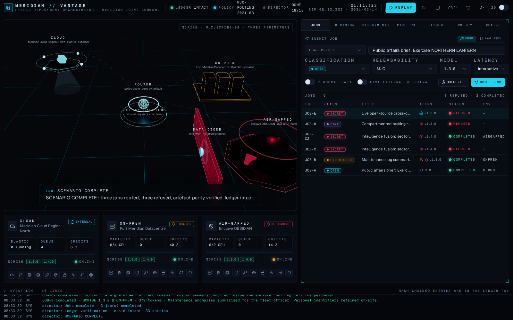
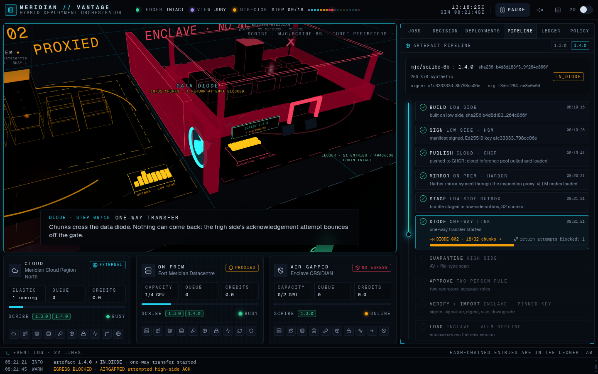
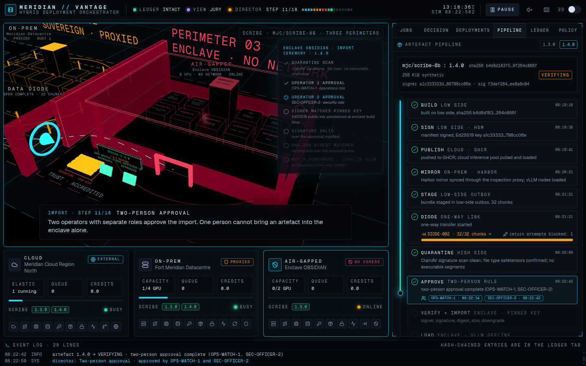
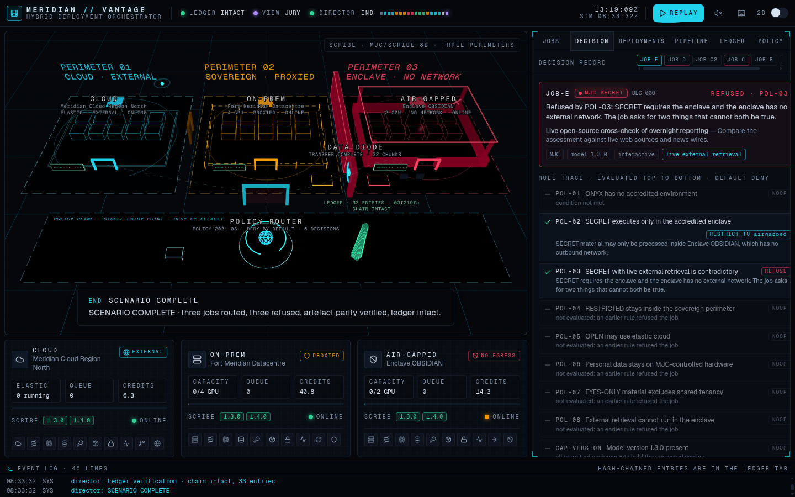
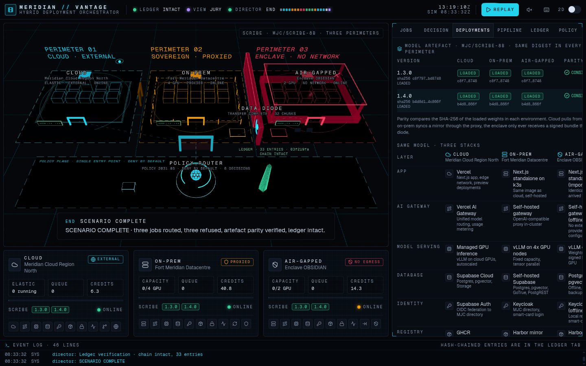
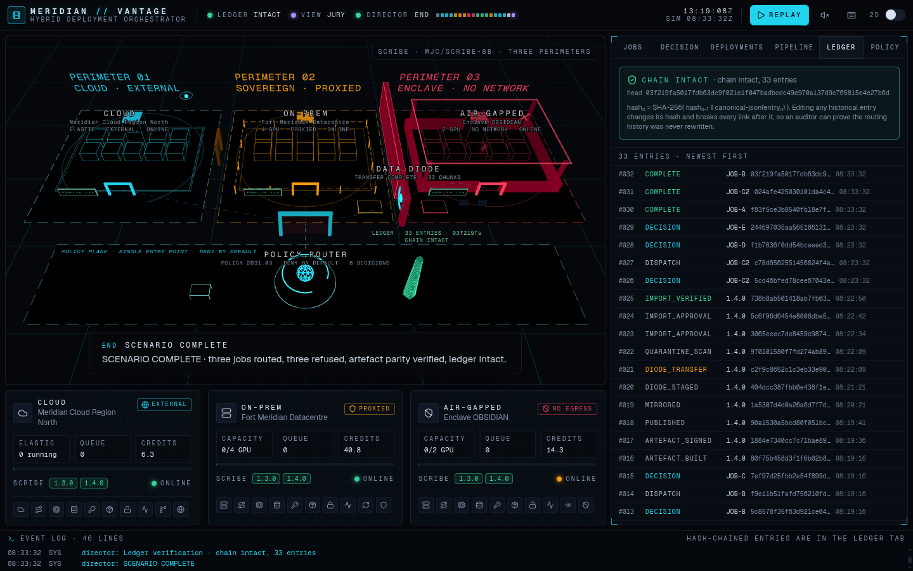

<div align="center">

# MERIDIAN // VANTAGE

### Hybrid Deployment Orchestrator — cloud + on-prem + air-gapped simulation

**One model. Three perimeters. Every decision justified.**

[](https://github.com/copsman/Hybrid-Deployment-Orchestrator/actions/workflows/ci.yml)
  

</div>

MERIDIAN // VANTAGE is a simulator and control room for a single AI workload (the fictional **SCRIBE** mission assistant, artefact `mjc/scribe-8b`) deployed across three environments of the fictional **Meridian Joint Command**:

| | CLOUD · Meridian Cloud Region North | ON-PREM · Fort Meridian Datacentre | AIR-GAPPED · Enclave OBSIDIAN |
|---|---|---|---|
| Capacity | elastic, metered per minute | 4 GPU slots, queue when full | 2 GPU slots |
| Network | external, egress allowed | outbound via inspection proxy only | **none** |
| Artefacts arrive by | registry pull (GHCR) | Harbor mirror through the proxy | **one-way data diode + two-person manual import** |
| Stack | Vercel, Vercel AI Gateway, managed GPU inference (vLLM), Supabase Cloud, Supabase Auth, Langfuse Cloud | Next.js standalone on k3s, vLLM on GPU nodes, self-hosted Supabase, Keycloak, Harbor, Vault, Prometheus/Grafana | the same containers imported through the diode: vLLM offline, Postgres + pgvector, Keycloak, Harbor (diode-fed), Vault, ClamAV quarantine, pinned signing key |

A **policy router** takes each job, evaluates a declarative, deny-by-default rule set against the job's classification and attributes, dispatches it to the right environment (or refuses it), and records the full decision with its justification in a **hash-chained ledger**. A **deployment view** shows the same signed model artefact, with the same SHA-256 digest, present and versioned in all three environments, including how it crossed the diode. A **director mode** plays the whole story like a film.

> Everything is simulated and deterministic. No API keys, no network calls, no database. The same seed produces the same decisions, digests and ledger hashes on every run.

<p align="center">
  
</p>
<p align="center">
  
  
</p>
<p align="center">
  
  
</p>

---

## Ninety-second walkthrough

<p align="center">
  <a href="docs/walkthrough/meridian-vantage-walkthrough.webm">
    
  </a>
</p>

[`docs/walkthrough/meridian-vantage-walkthrough.webm`](docs/walkthrough/meridian-vantage-walkthrough.webm) (VP8, about 11 MiB, about 90 seconds, silent) is one uncut run of the director in the jury view at 2× speed: the opener, six jobs through the policy router, the 1.4.0 bundle crossing the diode with the return attempt bouncing off the gate, the two-person import ceremony, digest parity and the ledger verification. GitHub plays it in the file viewer; click the poster above, or download the file. It is re-recorded from a production build with `npm run walkthrough` (Playwright's Chromium, headless; `WALKTHROUGH_HEADED=1 npm run walkthrough` renders on the machine's GPU), which also refreshes the six screenshots in `docs/screenshots/` from the same run.

---

## Quick start

Two ways to run it — pick one. Local Node is faster to iterate on; Docker needs nothing installed but Docker itself.

Requires **Node 22** (`.nvmrc` provided) and npm.

```bash
npm ci            # exact, locked dependencies
npm run dev       # control room on http://localhost:3000
```

Press **PLAY SCENARIO** in the top bar (or **PLAY THE SCENARIO** on the intro screen). The director resets the sandbox, submits the jobs, refuses the ones policy forbids, ships version 1.4.0 through the diode, and finishes with a ledger verification. Press it again for an identical second run. Useful URL switches: `?intro=0` skips the opener, `?speed=4` runs the director four times faster, `?jury=1` opens the jury view, and the **2D** toggle (or `M`) swaps the 3D scene for the SVG map. Press `?` for the presenter keys.

### Run with Docker

Requires only **Docker** and **Docker Compose** (`docker compose version`) — no Node install, no npm, and no cloud account of any kind.

```bash
make up           # builds the image, starts the app + a local HTTPS proxy
```

Open **https://localhost**. The `proxy` container is [Caddy](https://caddyserver.com/) terminating TLS with a certificate it mints itself (`tls internal`) for the `localhost` / `127.0.0.1` addresses — entirely offline, no ACME, no Let's Encrypt, nothing reaches the internet. Browsers show a one-time "not trusted" warning for that self-signed certificate; accept it, or run `make trust` to export the local root CA and add it to your OS/browser trust store. Command-line clients don't get a one-time warning — they refuse outright until you either trust that exported CA or skip verification for local testing: `curl -k https://localhost/`, `wget --no-check-certificate https://localhost/`.

The stack is two containers on an internal bridge network — `app` (the Next.js production server, non-root, read-only filesystem, all Linux capabilities dropped) is never exposed directly; only `proxy` publishes ports 80 (→ redirected to 443) and 443. Override the published ports with a `.env` copied from `.env.example` if 80/443 are taken.

```bash
make down         # stop and remove the containers
make logs         # follow both containers' logs
make verify       # typecheck + lint + test + demo + build, in a throwaway container
make clean        # also remove the named volumes (Caddy's local CA cache)
```

See `docker-compose.yml`, `Dockerfile` and `deploy/Caddyfile` for the details. Nothing here changes what the app does — the container just packages the same fully simulated, deterministic demo (`npm run dev` / `npm ci` above still work unchanged for local Node development).

### Presenter keys

The whole story can be driven from the keyboard; the rail in the top bar shows the step counter and one colour-coded segment per scenario step. Keys are ignored while typing in a field, inside a dialog, and while the opener is on screen.

| Key | Action |
|---|---|
| `SPACE` | play · pause · resume |
| `N` or `→` | next step (during the diode transfer the remaining chunks are drained at once) |
| `←` | re-centre the camera on the current step |
| `1` `2` `3` `4` `5` `6` | overview · router · cloud · on-prem · diode · enclave |
| `+` / `−` | faster / slower (0.5× 1× 2× 4×) |
| `SHIFT+R` | reset the sandbox (same seed, identical second run); plain `R` only warns |
| `S` | sound on / off |
| `M` | 2D map / 3D scene |
| `F` | fullscreen |
| `J` | jury view (hides the manual controls) |
| `?` | the legend; `ESC` closes it |

### Jury view

Open `/?jury=1` (or press `J`) for a presentation layout: the submit form, the pipeline and ledger tamper buttons, the raw policy JSON, the next/stop/speed/reset buttons and the WHAT-IF tab are hidden, the scene gets a wider frame, and the side panel follows the story on its own (JOBS → DECISION → PIPELINE → DEPLOYMENTS → DECISION → JOBS → LEDGER; a manual tab click sticks until the next chapter). Everything is still driven by the keys above, so nothing in the room can be edited by accident. The flag lives in the URL only and is never persisted; a plain visit always shows the operator controls.

Headless, no browser:

```bash
npm run demo             # runs the full scenario in Node and prints decisions, deployments, ledger checks
npm run demo -- --json   # machine-readable
npm test                 # unit + property-based tests (vitest + fast-check)
npm run verify           # typecheck + lint + test + demo + production build
npm run e2e              # Playwright (smoke, presenter, jury) against a production build (needs `npx playwright install chromium` once)
npm run walkthrough      # record the ninety-second video + poster and refresh docs/screenshots from a production build
```

Production build and Vercel: `npm run build && npm start`. The project deploys to Vercel with the default Next.js preset and no environment variables.

---

## The scenario the jury asked for

| Step | Job | Classification / attributes | Outcome | Why |
|---|---|---|---|---|
| A | Public affairs brief | **OPEN** | → **CLOUD** | POL-05 permits cloud or on-prem; cloud wins on cost (6.3 vs 10.2 credits) |
| B | Maintenance log summarisation | **RESTRICTED**, personal data | → **ON-PREM** | POL-04 restricts to the sovereign perimeter; POL-06 excludes cloud for personal data |
| C (1st) | Intelligence fusion | **SECRET**, needs model 1.4.0 | ✖ **REFUSED** (CAP-VERSION) | Enclave still runs 1.3.0; the router refuses instead of silently downgrading |
| — | Ship 1.4.0 | build → sign → publish → mirror → stage → **diode** → quarantine → **two-person approval** → verify (pinned key, Ed25519, SHA-256, size, downgrade) → load | parity 1.4.0 consistent | Same digest in all three environments |
| C (2nd) | Same job again | **SECRET**, 1.4.0 | → **AIR-GAPPED** | POL-02: SECRET executes only inside the enclave |
| D | Compartmented tasking | **ONYX** | ✖ **REFUSED** (POL-01) | No environment in this deployment is accredited for ONYX |
| E | Live open-source cross-check | **SECRET**, live external retrieval | ✖ **REFUSED** (POL-03) | SECRET means the enclave; the enclave has no network; the constraints conflict |

Three classifications land in three environments, three requests are refused with three different, logged reasons.

---

## The scene

The 3D control room is a **linear security gradient**, read left to right by trust: PERIMETER 01 CLOUD, the inspection proxy, PERIMETER 02 SOVEREIGN (on-prem), the data-diode wall, PERIMETER 03 ENCLAVE. In front of the three plates runs the **policy plane**: the build-and-sign bench on the low side, the policy router as the single entry point, the ledger obelisk, and one barrier arch that every route passes before fanning out to a perimeter. The air-gapped route is the only geometry that crosses the wall, and it does so through the diode gate. Each perimeter carries the same generic campus with the same ten-layer stack (app, AI gateway, model serving, database, identity, registry, secrets, observability, updates, network); only the enclosure differs: an open pad with an uplink mast, a fenced yard behind the proxy checkpoint, bunker walls under a glass canopy with a crossed-out mast.

Everything that moves is read from the engine snapshot, nothing is scripted for the camera. GPU slot LEDs on the on-prem and enclave towers and elastic pods on the cloud apron light per running job; queue tokens, coloured by classification, line up at a full site's gate; version plaques read `SCRIBE 1.3.0 · 1.4.0`, `1.4.0 PENDING` or `1.4.0 REJECTED`; the router headline counts decisions against the real policy version and the barrier flashes `REFUSED · POL-01` or pulses `JOB-B → ONPREM` as each packet arrives; the signed bundle token travels bench → cloud registry → proxy → on-prem registry → outbox and reappears in the enclave registry once imported; the diode conveyor carries the real 32 chunks over the gate under a live counter (`18/32 CHUNKS · 1 RETURN ATTEMPT BLOCKED`), a scanner sweeps the quarantine tray and two operator consoles turn green per approval; the obelisk gains a link per ledger entry and reads `CHAIN INTACT` or `CHAIN BROKEN`. Every label is in-world text set in a locally served Geist Mono, so the scene never touches the network. The 2D map (`M`) is the same drawing in SVG, with the same counters, LEDs, plaques and verdicts.

---

## What is in the box

```
src/engine/                 pure TypeScript, no React — runs in the browser, in Node and in the tests
  policy/rules.json         the routing policy as data (POL-01 … POL-08), validated by zod at load
  policy/evaluate.ts        deny-by-default evaluator, per-rule trace, capability checks (CAP-VERSION, CAP-EGRESS)
  router.ts                 selection among permitted environments: free capacity → cost → free slots
  artefacts/crypto.ts       SHA-256 + Ed25519 (noble), the only crypto module
  artefacts/canonical.ts    canonical JSON used for every signature and hash
  artefacts/manifest.ts     signed manifests, bundle verification against the pinned key
  ledger.ts                 hash-chained decision ledger + verifier
  index.ts                  Engine: environments, jobs, artefact pipeline state machine, diode, import, parity
  scenario.ts / whatif.ts   the director script; counterfactual explanations for refused jobs
src/store/                  zustand stores: engine snapshot, event log, packets for the scene, the director (presenter state, jury flag)
src/lib/                    palette.ts (scene colours, local font, glyph set), sfx.ts + sfx-bindings.ts (WebAudio kit driven by the stores)
src/components/scene/       react-three-fiber scene: layout.ts (gradient geometry, routes, camera presets), Zones, Site, Hub, Routes, Packets,
                            Ledger, DiodeGate, ArtefactFlow, CameraRig, SceneText, materials, selectors.ts (string-key selectors), labels.ts
src/components/scene/map2d  the 2D SVG mirror: geometry, Campus, Diode, PolicyPlane, Packets, Artefact (composed by Fallback2D.tsx)
src/components/control-room Jobs, Decision trace, Deployments (stack matrix + parity), Pipeline, Ledger, Policy, What-if,
                            Hotkeys, PresenterRail, ShortcutLegend, ImportCeremony
public/fonts/               GeistMono-Regular.ttf + its OFL licence, the only asset the scene loads
scripts/                    demo.ts (headless run), record-walkthrough.mjs (video + screenshots), build-submission.mjs (PDF)
tests/engine/               vitest unit tests and fast-check invariants
tests/scene/                layout invariants (zones, wall, routes, trays, camera) and glyph coverage of every label
tests/e2e/                  Playwright: smoke (×2), presenter keys, jury view
```

### Policy as data

Rules live in [`src/engine/policy/rules.json`](src/engine/policy/rules.json) and are shown verbatim in the POLICY tab. Evaluation is top to bottom with a default effect of **DENY**: a job is only routable if a `RESTRICT_TO` rule grants a set of environments, `EXCLUDE` rules subtract from it, and any matching `REFUSE` rule ends evaluation. Two capability checks then run and are traced like rules: the requested model version must be loaded in the environment (`CAP-VERSION`, which reports "pending diode transfer" while a bundle is in flight) and live external retrieval needs an environment with outbound network (`CAP-EGRESS`). Fixed-capacity environments queue when full; nothing ever spills to a less restrictive perimeter.

Every submission, allowed or refused, produces a decision record: the input snapshot, every rule with matched / effect / note, a candidate table with the reason each environment was excluded, the verdict, the tie-break, and the hash of the ledger entry that recorded it.

### The artefact pipeline and the diode

```
BUILT → SIGNED → PUBLISHED (cloud) → MIRRORED (on-prem) → STAGED → IN_DIODE → QUARANTINE → VERIFYING → IMPORTED → LOADED
                                                                                    └────────────── REJECTED
```

The artefact bytes are a deterministic synthetic buffer, so the digests are real. The manifest (`name, version, digest, sizeBytes, format, builtAt, builder`) is canonicalised and signed with Ed25519. The signing key lives on the low side; each environment holds only the pinned public key. The diode is modelled as a chunked, one-way transfer with no acknowledgement; the enclave's attempt to send an ACK back is counted and shown bouncing off the gate. On the high side the bundle sits in quarantine, needs two distinct operators to approve, and is verified before import: signer equals pinned key, signature valid over the canonical manifest, SHA-256 of the received bytes equals the signed digest, size matches, and the version is not a downgrade. The PIPELINE tab has "tamper" buttons that flip one byte or re-sign with a rogue key so you can watch the import get rejected.

### The ledger

`hash_n = SHA-256( hash_{n-1} ‖ canonical-json(entry_n) )`, genesis previous hash all zeros. Every decision, dispatch, completion, publish, mirror, diode transfer, scan, approval, import and rejection is a link. The LEDGER tab can verify the chain, tamper with a historical decision (the verifier points at the exact entry) and restore it.

### What-if

A dry run of the policy plus single-attribute counterfactuals: "drop the live retrieval requirement → would route to AIR-GAPPED", "pseudonymise the input → would route to CLOUD", or "no single change makes this routable". Nothing is dispatched or recorded.

---

## Cryptography notes (what we did and did not do)

- SHA-256 for digests and the ledger chain, Ed25519 (RFC 8032, strict verification, `zip215: false`) for manifests, both from the audited `@noble` libraries. No home-made primitives.
- Signatures are over a canonical JSON encoding (sorted keys, no whitespace, no `undefined`/`NaN`), property-tested for idempotence and key-order independence, so a re-serialised manifest verifies and an edited one does not.
- **Nothing is encrypted.** The requirement is integrity and authenticity of artefacts and decisions, not confidentiality of the bytes on the wire; confidentiality across the gap is the diode's physical property. That also means there is no nonce anywhere to reuse.
- Keys are derived from the demo seed so runs are reproducible. In production the build key sits in an HSM on the low side and only the public half is provisioned into each environment.

---

## Testing and reproducibility

- `npm test`: 56 tests. Property-based invariants (fast-check) include: SECRET never lands on cloud or on-prem, ONYX is always refused, jobs needing external retrieval never land in the enclave, personal data never lands in cloud, every decision has a rule id and a justification, the ledger detects tampering at any position, a flipped byte or a wrong signer is always rejected, the input schema never throws on arbitrary JSON, and two fresh runs produce identical ledgers.
- The scene tests (`tests/scene/`) pin the picture to the story: the three perimeter plates and the policy strip are disjoint and ordered by trust, the proxy and the wall sit in the gaps, every campus part stays inside its zone, every route passes the barrier arch, only the air-gapped route crosses the wall and only through the gate aperture, all 32 chunk slots sit in their trays, the same ten-layer stack maps onto the module grid in every environment, there is one camera preset per focus, and the solved overview fits the whole gradient and clears the caption box at five frame shapes. A second file proves that every label, template and engine-supplied string (site and stack names, job ids, rule ids, operator names, versions, hashes) uses only glyphs the local font has, so the scene can never trigger a font download.
- `npm run demo` runs the same scenario headless and exits non-zero if any step fails or the ledger does not verify. CI runs it twice and diffs the results.
- `npm run e2e` drives the real UI in Chromium, four tests in three specs: the smoke spec plays the scenario to "SCENARIO COMPLETE", checks where each job landed, breaks and restores the ledger, then submits garbage JSON and resets; the presenter spec drives the director from the keyboard and proves the keys stay quiet while typing; the jury spec proves `?jury=1` hides every manual control, follows the story through the tabs, and that `J` restores the operator page. All four assert zero page errors.
- Reset restores the seed: a second run in the same tab reproduces the first, hash for hash.

## Accessibility and fallbacks

The 3D scene is decoration. The **2D** switch in the top bar (or `M`, or `prefers-reduced-motion`) swaps it for an SVG map with the same left-to-right organisation, packets, chunk counter, LEDs, plaques and verdicts, and the control room falls back to the map automatically if WebGL is unavailable or the scene fails to render. Under reduced motion the map keeps the state-driven flights and stops its decorative loops. Sound is off by default; the speaker button (or `S`) turns on a synthesised WebAudio kit with no audio assets: a quiet ambient bed while the director plays, a distinct two-note motif per marking when a job is routed, a buzzer for every refusal, rising ticks for the diode chunks with a thud for the blocked return path, two approval stamps, a chord when the bundle is verified, a tick per ledger link, a chime when the chain verifies and a sting at the end. Muting is instant and nothing is queued while sound is off.

## Mapping to real tooling

The policy engine plays the role an OPA or Cedar sidecar plays in production; the artefact signing mirrors Sigstore cosign and SLSA provenance; the diode and import ceremony mirror commercial unidirectional gateways and cross-domain solutions; the three environments correspond to a sovereign cloud region, an on-prem Kubernetes estate and an air-gapped distributed-cloud appliance. The same open-weight model is served by vLLM everywhere and addressed through one OpenAI-compatible gateway, which is what makes "same model, three stacks" practical.

## Continuing this project

`docs/HANDOFF.md` is the state-of-the-world document for anyone (or any assistant) picking this up: decisions already made, what is verified, open items, and conventions. `CLAUDE.md` carries the short version that Claude Code loads automatically.

## Submission deck and roadmap

- `docs/submission/MERIDIAN-VANTAGE-submission.pdf` is the five-page jury deck (title, objective, solution, validation, results). Regenerate it with `npm run submission`; set `SUBMISSION_TEAM` and `SUBMISSION_LIVE_URL` to stamp your team name and Vercel URL onto the title page. The source is `docs/submission/submission.html`.
- `docs/ROADMAP.md` lists what comes after the hackathon: real inference adapters, ledger persistence, OPA/Cedar export, cosign-signed bundles, coalition releasability, attestation, and the research directions.

## Limitations

This is a simulator. Capacity, cost and latency are modelled, not measured; jobs produce a simulated output line rather than real inference; the diode is a state machine, not a protocol implementation. The architecture is deliberately the one a real deployment would have, so swapping the evaluator for OPA, the signer for cosign, and the environments for real clusters changes adapters, not the control room.

## Licence

MIT. All names, units, markings and places are fictional.
